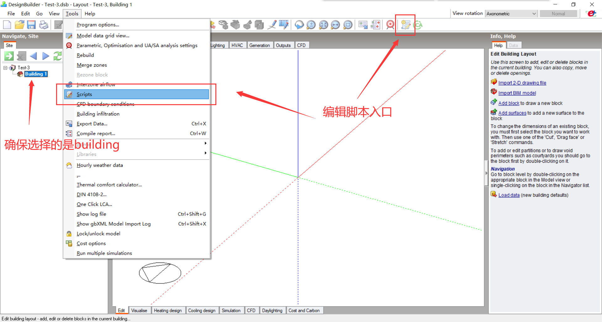
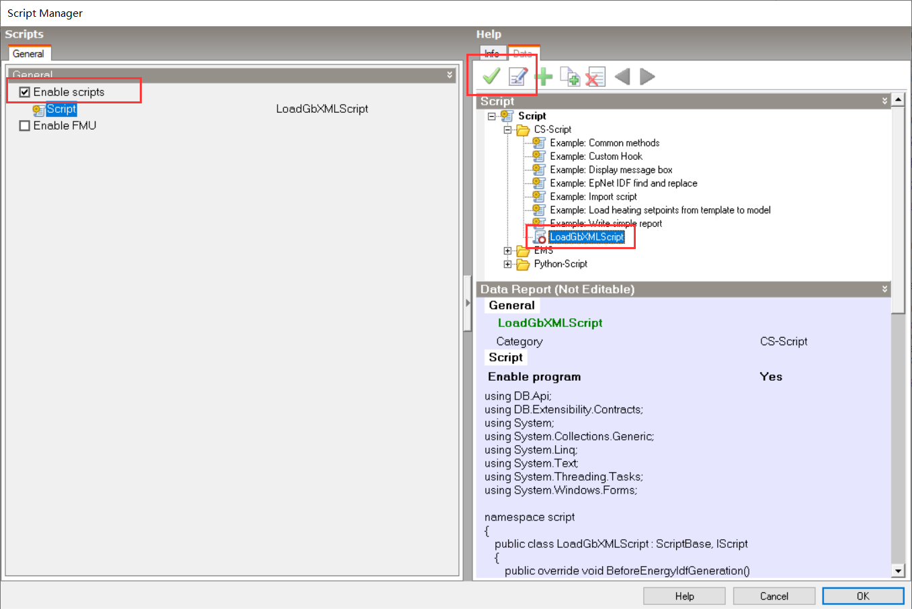

# gbXMLScript

自动化构建建筑模型 gbXML 文件并导入 DesignBuilder 进行模拟

## 依赖

db_batch模块使用[TheCuprum/db-batch](https://github.com/TheCuprum/db-batch)，直接复制源码文件夹即可（dbbatch -> dbbatch）
其他依赖见[requirements.txt](requirements.txt)

## 运行环境配置

1. 确保计算机上已安装 DesignBuilder v6.0 及以上版本
2. 确保此项目的代码在合适的位置
3. 创建 Python 虚拟环境并安装相应依赖，可用 [shell_scripts/setup_environments.ps1](shell_scripts/setup_environments.ps1) 脚本一键创建，除了前文提及的 db-batch 模块

```
.\shell_scripts\setup_environments.ps1
```
4. 在合适位置创建 4 个文件夹，分别用于：模型（.dsb）输入、模型备份、单次结果输出、全部结果保存。
5. 准备一个或多个不包含 Building Blocks 的`dsb`文件，设置模拟需要的各种参数（地理位置、模拟时间等），复制入 `4.` 中创建的`模型输入`文件夹
6. 在所有待模拟的`dsb`文件中，加入并启用以下脚本（注意修改 `MODEL_FILE` 变量）：
```C#
using DB.Api;
using DB.Extensibility.Contracts;
using System;
using System.Collections.Generic;
using System.Linq;
using System.Text;
using System.Threading.Tasks;
using System.Windows.Forms;

namespace script
{
    public class LoadGbXMLScript : ScriptBase, IScript
    {
        public override void BeforeEnergyIdfGeneration()
        {
            string MODEL_FILE = "";
            // 此处改为 gbXML 加载位置，默认为本项目位置 + xml\edited_gbxml_file.xml
            // 注意特殊转义字符，例如 \ 需要写成 \\ 
            // 假设本项目在 D:\gbXMLScript\ 下，那么需要改为 
            // "D:\\gbXMLScript\\xml\\edited_gbxml_file.xml"

            List<Boolean> results = new List<bool>();
            GbXmlFile gbxml = ApiEnvironment.GbXmlFileOperations.Current;
            results.Add(gbxml.LoadFile(MODEL_FILE));
            results.Add(gbxml.ImportModel());
        }
    }
}
```


7. 修改 [test.py](test.py)
   1. 必须修改的代码（注意特殊符号转义）：
      - `input_dir = ''` 改为`模型输入`文件夹所在路径
      - `input_backup_dir = ''` 改为`模型备份`文件夹所在路径
      - `output_dir = ''` 改为`单次结果输出`文件夹所在路径
      - `copy_dir = ''` 改为`全部结果保存`文件夹所在路径
      - `db_path = ''` 改为`DesignBuilder可执行文件`所在路径，例如：`r'D:\Program Files (x86)\DesignBuilder\DesignBuilder.exe'`
      - `job_server_dir = ''` 改为`DesignBuilder模拟服务器`所在路径，例如：`r'D:\ProgramData\DesignBuilder\JobServer\Users\User'`
      - `for i in range(0):` 改为所需的任何形式的循环，循环体内已有的语句不建议修改，但是可以新增（例如调整生成建筑的形状）
   2. 按需编写的代码：
      - 所研究模型的必须数据（长、宽、高、角度等）
      - *使用已有代码无法构建的模型

## Coding Documents

- **Segment3CalculatorBuilder & Segment3Calculator**:
  - 见源码注释 [calculator/segment3_calculator_builder.py](calculator/segment3_calculator_builder.py)，[calculator/segment3_calculator.py](calculator/segment3_calculator.py)